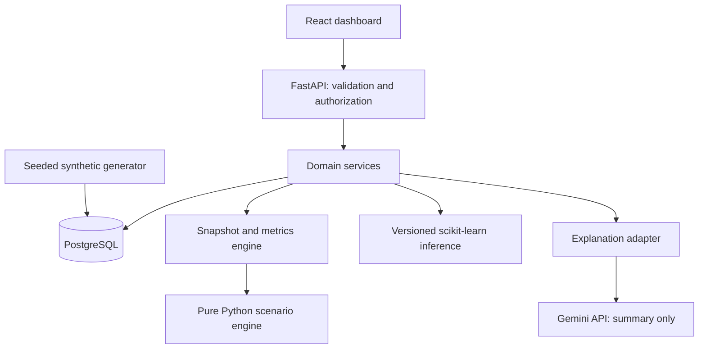

# AI-Powered College Digital Twin — Technical Blueprint

Status: M1 foundation implemented; local checks recorded below. PostgreSQL integration and Docker verification pending; Docker setup deferred by user. Updated 2026-09-13.

This is the living source of truth requested by the master prompt. M1 implementation was explicitly requested on 2026-09-13. M1 covers foundation and clean synthetic data only; later milestone contracts remain proposed. Confirmed team: three students including the user. Plan for 12 weeks; any additional time is contingency, not required capacity. Budget remains provisionally near-zero.

## 1. Vision & scope

Build a synthetic-data college operations digital-twin prototype that reconstructs a dated operational state, detects scheduling problems, estimates future attendance risk, and compares a room-closure scenario with a frozen baseline. An administrator should be able to explain every displayed metric and reproduce every scenario.

### Concept stress test

- Without connection to a physical college, describe the result as a **synthetic-data digital-twin prototype**, not a deployed live twin. Replay of dated synthetic records demonstrates state evolution; real synchronization remains future work. NIST discusses forecasting and synchronization as relevant twin concerns [1, 2].
- Scheduled room occupancy is not measured occupancy. Attendance establishes presence at a recorded class, not current campus presence. Omit `faculty_present` and live campus headcounts because the proposed data cannot establish them.
- Basic reference-data storage is enabling infrastructure. Do not build admissions, fees, payroll, messaging, or general CRUD administration screens.
- The integration and reproducible evaluation are applied engineering contributions. Neither logistic regression nor greedy room reassignment is claimed as a novel algorithm.
- Predicting whether the **current** attendance rate is under a threshold is arithmetic, not ML. The classifier must predict attendance during a future horizon.
- Room closure has a visible, independently checkable outcome and is the only MVP simulation. Attendance shock and new intake are **unimplemented future scenarios**, never advertised as supported.

| Tier | Included | Completion evidence |
|---|---|---|
| MVP | Relational synthetic data; dated state snapshots; room/faculty/section conflicts; room closure with deterministic reassignment; future attendance-risk classifier; dashboard | Reproducible seed, verified fixtures, evaluation output, end-to-end demo |
| Optional after core gates | Single-provider explanation of validated scenario results, with deterministic fallback | Provider failure never prevents scenario completion |
| Phase 2 | RAG copilot using PostgreSQL/pgvector, additional scenarios/models, richer facilities | Start only after all MVP gates pass |
| Stretch | Live synchronization, multi-scenario comparison, resource forecasting | Future-work discussion only |

### Requirements and delivery order

| Milestone | Suggested weeks | Dependency / work | Exit gate |
|---|---|---|---|
| M0 Design | 1 | Confirm constraints; review this blueprint | Scope, data semantics, API contracts and tests settled |
| M1 Foundation | 2–3 | M0; backend/frontend shell, migrations, auth, relational generator | One-command local startup; same seed reproduces logical data; integrity tests pass |
| M2 State and anomalies | 4–5 | M1; snapshots, metrics, read-only dashboard. Frontend/integration owner starts building against mocked API responses in week 4, not week 9; replace mocks as backend contracts become available. | Hand-calculated fixture matches; each anomaly rule has positive and negative cases; frontend mock contracts reviewed with backend owner |
| M3 Simulation | 6–7 | M2; closure, reassignment, baseline comparison | Determinism and baseline immutability verified; no-solution case is explicit |
| M4 Prediction | 6–8 | M1–2; temporal features, baselines, logistic regression | Leakage checks and untouched-test metrics reported, even if model loses |
| M5 Integration | 9–10 | M3–4; finish connecting the UI built from week 4 to real APIs, optional explanation, error states | Full demo works without LLM credentials; authorization and integration checks pass |
| M6 Evaluation and defense | 11 | M5; performance measurements, report and viva evidence | Reproducible demo, actual evaluation tables, limitations and references |
| Buffer | 12 and any extra time | Failed gates / report corrections | No new features until required deliverables complete |

For the confirmed three-person team, proposed ownership is frontend/integration, backend/state/simulation, and data/ML/evaluation. M3 and M4 can run concurrently after M2 contracts are stable. All three review contracts and contribute report evidence each week. Twelve weeks is workable for this bounded scope, but integration and academic deliverables need protected time. LLM explanations start only if core gates pass; deterministic recommendations are sufficient for the required demo. These estimates are not a promise.

Demo sequence: select synthetic date → inspect state and anomalies → close one room → compare baseline, disrupted, and reassigned schedules → inspect future attendance risk with model provenance → explain limitations. Replay advances the selected time over existing dated data; it is not a background event platform.

## 2. Architecture & domain model

Stack: React, TypeScript, Vite, Tailwind, Recharts; Python, FastAPI, Pydantic, SQLAlchemy and Alembic; PostgreSQL; Pandas, NumPy and scikit-learn; Faker; Docker Compose. Use pytest for backend checks, Vitest/React Testing Library for UI behavior, and Playwright for the main demo. M1 package versions are locked and local build/unit checks have run. Container digest locking and full stack compatibility verification remain pending with Docker deferred.

**Decision: modular monolith.** One API process and one database keep transactions and local debugging manageable for a semester. Domain functions accept typed data rather than HTTP requests. No Redis, Celery, microservices, agent framework, or separate vector database is justified at MVP scale.

**Decision: immutable data editions and snapshots.** Generate an edition atomically and freeze it. Snapshots reference that edition, cutoff and window, and persist canonical inputs, computed metrics and hashes. A scenario always uses the saved inputs, so later editions cannot silently change its baseline. Corrections produce a new edition. This avoids a full event-sourcing implementation while preserving reproducibility.

**Decision: one room entity.** Labs are rooms with `kind=lab` and a lab type. Courses specify required room kind/type. This preserves lab compatibility without duplicate occupancy logic. An explicit CourseOffering connects course, section, faculty and term; dated ClassSessions represent the timetable. MVP excludes electives across sections, team teaching, and student section transfers within an edition.

Proposed module boundaries for later implementation: backend API/auth; domain state, anomalies, simulation and risk; persistence/models; offline generation/training; frontend state, scenarios and risk views; tests. M0 created this blueprint; see the M1 implementation record for the current implemented subset.

## 3. Database design

All domain records belong to a dataset edition. Use UUID primary keys; edition-aware foreign keys prevent cross-edition joins. Names use obvious labels such as Student-001, never phone numbers, addresses or realistic identifiers. Dates and timestamps use Asia/Kolkata for display and UTC storage.

| Table | Proposed essential fields / constraints |
|---|---|
| DatasetEdition | id, seed, generator_version, config, logical_content_hash, created_at, frozen_at |
| Department | id, edition_id, code unique within edition |
| Program | id, edition_id, department_id, code |
| Batch | id, edition_id, program_id, start_year |
| Section | id, edition_id, batch_id, code |
| Student | id, edition_id, section_id, synthetic_label |
| Faculty | id, edition_id, department_id, synthetic_label |
| Course | id, edition_id, department_id, code, required_room_kind, required_lab_type nullable |
| Term | id, edition_id, start_date, end_date; start before end |
| CourseOffering | id, edition_id, course_id, section_id, faculty_id, term_id |
| Room | id, edition_id, code, capacity positive, kind classroom/lab, lab_type nullable |
| ClassSession | id, edition_id, offering_id, room_id, starts_at, ends_at, status scheduled/held/cancelled, status_recorded_at; positive duration |
| Attendance | id, edition_id, session_id, student_id, status present/absent, recorded_at; unique session/student |
| StateSnapshot | id, edition_id, as_of, window_start/end, schema_version, canonical_inputs JSONB, metrics JSONB, input_hash, created_at |
| SimulationRun | id, snapshot_id, created_by, normalized_parameters JSONB, engine_version, result JSONB, created_at |
| ModelArtifact | id, edition_id, feature_version, training_cutoff, config, metrics JSONB, trusted_local_path, artifact_hash |
| PredictionRun | id, snapshot_id, model_id, horizon_start/end, result JSONB, created_at |
| User / Session | user id, username, password_hash, role viewer/planner; session token hash, expires_at |
| AuditLog | id, actor_id, action, resource_id, request_id, occurred_at, outcome |

Attendance must reference a student in the offering's section; its session must be held and its recording time must follow session end. Validate these relational rules during generation and import inside a transaction. SQL enforces keys, uniqueness and scalar checks; service validation enforces cross-table domain rules. Deliberate anomaly fixtures may violate scheduling feasibility, never referential integrity.

Do not add exclusion constraints that prevent storing overlapping timetable sessions: detecting those conflicts is a requirement. Index edition/time on sessions, student/session on attendance, and offering section/faculty references. Frozen editions are read-only to the application; generated additions use a separate controlled loader.

### State semantics

Every state response includes edition, cutoff, reporting window, schema version, data coverage and the synthetic-data label. Intervals are half-open `[start,end)` so adjacent classes do not overlap.

- Scheduled occupancy at time t: distinct assigned rooms with noncancelled sessions spanning t. This is a planned-use metric.
- Available rooms at t: all rooms minus scheduled occupied rooms and scenario closures; room suitability is checked separately.
- Utilization: union of booked minutes per room divided by available teaching minutes in the window. Teaching hours are a dataset configuration, initially weekdays 09:00–17:00. Closures reduce availability; expose the denominator in comparisons. Zero availability returns null, not zero or infinity.
- Attendance rate: present / (present + absent) for eligible held sessions ending by cutoff and records known by cutoff. Missing records are unknown, not absent. Also report coverage = recorded / expected attendance rows.
- Faculty workload: scheduled teaching minutes by faculty; explicitly not total employment workload.
- Scheduled classes: count noncancelled sessions in the window. Anomaly counts and details accompany metrics rather than being hidden by aggregation.

## 4. API surface

All paths below are proposed under `/api/v1`. JSON identifiers are UUIDs; dates are ISO 8601 with offsets. Responses expose provenance. Lists are paginated (default 50, max 200); scenario windows are capped at seven days. All reads except health/login require authentication.

| Method/path | Input / response | Role |
|---|---|---|
| POST /auth/login | username/password → HttpOnly session cookie | Public, rate limited |
| POST /auth/logout | invalidate current session → 204 | Signed in |
| GET /datasets | edition metadata and synthetic time range | Viewer/planner |
| GET /rooms | edition_id → room identifiers, kinds, capacities | Viewer/planner |
| POST /snapshots | edition_id, as_of, window_start, window_end → 201 snapshot with metrics and anomalies | Planner |
| GET /snapshots/{id} | frozen metrics, coverage, provenance | Viewer/planner |
| GET /snapshots/{id}/sessions | paginated timetable and anomaly details | Viewer/planner |
| POST /simulations | snapshot_id, type=room_unavailability, room_id, closure_start/end → 201 run | Planner |
| GET /simulations/{id} | baseline, disrupted and reassigned results, diffs, unresolved sessions | Viewer/planner |
| POST /prediction-runs | snapshot_id, model_id → 201 future risk results | Planner |
| GET /prediction-runs/{id} | risk, insufficient-data status, horizon and model metadata | Viewer/planner |
| POST /simulations/{id}/explanation | persisted validated diff → summary and source=template/llm | Planner |
| GET /health | minimal readiness, no credentials or internal paths | Public |

Use a common error body with code, message, field errors and request_id. Return 401 unauthenticated, 403 wrong role, 404 missing resource, 409 incompatible edition/model or unusable baseline, and 422 invalid parameters. Resolve authorization before returning private resource details. Internal errors omit stack traces from responses.

Scenario requests are synchronous for this bounded workload. Persist only completed results transactionally; no half-completed runs. Accept an idempotency key on creation endpoints; scope it to user/path and reject reuse with a different request hash. If measured workloads exceed the performance gate, revisit execution design rather than silently increasing scope.

## 5. AI/simulation design + evaluation notes

### Room-closure simulation

1. Load immutable baseline inputs; validate room membership, closure interval and seven-day bound. Require a planning window at or after the snapshot cutoff.
2. Detect baseline conflicts. Display them, but reject reassignment for an already infeasible baseline with 409 and actionable details; separate fixtures demonstrate anomaly detection.
3. Mark any session overlapping the room closure as displaced for its entire duration. Preserve course, students, faculty and time.
4. Report the disrupted state before repair: displaced sessions and affected distinct students, with no invented attendance effects.
5. Process displaced sessions by descending section size, then start time and session ID. Consider rooms in ascending spare capacity, then room ID. A candidate must match room/lab requirements, fit enrolled section size, and be free for the full interval; include earlier assignments in availability checks.
6. Assign the first feasible candidate or mark the session unresolved. Never cancel, shorten or reschedule a class silently. Recompute metrics and all conflict rules.
7. Persist old/new room mappings, unresolved reasons, stable deltas and a deterministic recommendation. Never update source timetable or attendance.

**Decision: greedy allocation with explicit limits.** This is understandable and repeatable, but can miss a globally feasible solution. Say “no room found by this heuristic,” not “no possible solution.” Compare a few tiny fixtures against exhaustive manually enumerated assignments for the report; adopting an optimizer remains a separate scope decision. OR-Tools is a relevant constraint-scheduling alternative [5].

Anomaly rules: room overlap, faculty overlap, section overlap, over-capacity and incompatible room type. Each result has a stable rule code, entity/session IDs, interval, severity and explanation. Boundary-touching intervals are not conflicts. Deduplicate symmetric pairs.

Acceptance example: two simultaneous classes of 30 and 40 students; the 40-student class loses its room, an occupied 50-seat room cannot be used, and a free compatible 45-seat room can. Expected: one affected session, 40 distinct affected students, one reassignment, zero unresolved sessions, no new conflicts. Removing the 45-seat room yields one unresolved session. Baseline hash remains unchanged in both cases.

### Attendance-risk prediction

Unit of prediction: student within a course offering at cutoff. Target: recorded attendance fraction below a configurable 75% threshold over the next 14 calendar days, with at least three held sessions and complete label coverage. The threshold is a demo setting, not a claim about institutional regulations. Missing future observations make the training label ineligible.

Features use only records available at cutoff: trailing 28-day attendance rate, observed-session count, consecutive absences, recent versus prior attendance trend and coverage. Require at least five observed past sessions and 80% historical coverage; otherwise return insufficient_data. Never include student identifiers, generator latent parameters, future attendance or future labels as predictors.

Compare a prior-probability DummyClassifier, a current-rate threshold rule, and standardized logistic regression. Fit preprocessing only on training rows using a pipeline [3, 4]. Split chronologically and purge training/validation examples whose label horizon crosses the next partition boundary. Select thresholds on validation only; lock the final test partition. Repeated students across temporal partitions represent forecasting known students; add a separately seeded cohort test to expose generator dependence.

Report sample counts, class prevalence, precision, recall, F1, PR-AUC, confusion matrix and Brier score with split dates, threshold and generator/model versions. Use student-group bootstrap uncertainty where sample size permits. If a partition lacks either class, flag metrics as not estimable. Do not impose or fabricate a target accuracy. A classifier that fails to beat simple baselines is an honest finding; ship the rule as the preferred decision aid if justified.

**Decision: separate forecasting from simulation.** A room closure does not establish a causal attendance change. Scenario results will not recompute ML risk from imagined attendance. Both features share state/provenance but answer distinct questions.

### Synthetic data and reproducibility

Default proposed dataset: two departments, two programs, two batches per program, two sections per batch, 30 students per section (240 total), 16 faculty and 12 rooms including two labs, over 16 weeks. Generate offerings and a feasible dated timetable first, then attendance with seeded individual tendencies, week effects and randomness. Keep deliberate conflicts in separately labeled editions. Include sparse data, balanced/imbalanced risk distributions and a shifted-attendance evaluation seed.

Record generator version, parameters, RNG seeds, dependency lockfiles and canonical logical hashes. Sort rows and use deterministic identities for comparisons. Never use latent attendance tendencies as training features. A clean seed must satisfy all relational and schedule checks; an anomaly seed has an explicit expected-rule manifest. Synthetic success establishes pipeline behavior under those assumptions, not real college effectiveness.

### LLM boundary

Proposed provider/model pin: Google Gemini API, `gemini-3.1-flash-lite`, whose official documentation and lifecycle page were checked on 2026-09-13 [6, 7]. Recheck access, price and lifecycle before integration; no API call or cost claim has been validated locally. No fallback provider or floating “latest” alias.

Only send aggregate validated facts and deterministic recommendations. No names, per-student predictions, credentials or raw database rows. The provider can rephrase the explanation; it receives no database tools. Validate output size and structure, display computed numbers directly from the backend, and fall back to a template on timeout, invalid output, unavailable credentials or budget exhaustion. Cache by result/model/prompt hash, set a short timeout and configurable request/token limits, and allow disabling all network explanation calls. This is an optional language layer, not the decision engine.

### Academic evidence ledger

| Feature | Existing approaches / references | Contribution and evaluation | Limitation |
|---|---|---|---|
| State/dashboard | Twin representations and forecasting [1, 2] | Reproducible dated state, independently calculated metric fixtures | Synthetic replay; no physical sensing |
| Scheduling anomalies and simulation | Twin modeling [1, 2], constraint scheduling [5] | Shared state plus explainable closure/repair; fixture correctness and tiny exhaustive comparisons | Greedy repair; no optimality claim |
| Attendance forecast | Dummy estimators and leakage-safe pipelines [3, 4] | Future-horizon evaluation against simple rules; temporal and shifted-seed metrics | No demonstrated real-world generalization |
| Explanation | Provider capabilities [6], trust concerns [2] | Grounded summary with deterministic fallback; factual consistency and outage cases | Language quality is not decision accuracy |
| Synthetic generator | Model trust considerations [2], leakage safeguards [3] | Versioned relational dataset; invariant checks and repeated-seed hashes | Generator assumptions shape results |

These are verified primary technical references/tools for design grounding, not a completed university literature survey. M1 foundation checks are recorded below; no simulation or ML evaluation result exists yet. Before report submission, add feature-specific peer-reviewed studies if required by the university and record their exact relevance; do not invent citations or claim algorithmic novelty.

References:

1. NIST, Digital twins: https://www.nist.gov/digital-twins
2. NIST, Security and Trust Considerations for Digital Twin Technology, IR 8356: https://tsapps.nist.gov/publication/get_pdf.cfm?pub_id=957183
3. scikit-learn, Common pitfalls and recommended practices: https://scikit-learn.org/1.8/common_pitfalls.html
4. scikit-learn, Dummy estimators: https://scikit-learn.org/stable/api/sklearn.dummy.html
5. Google OR-Tools, Scheduling overview: https://developers.google.com/optimization/scheduling
6. Google, Gemini 3.1 Flash-Lite: https://ai.google.dev/gemini-api/docs/models/gemini-3.1-flash-lite
7. Google, Gemini deprecations: https://ai.google.dev/gemini-api/docs/deprecations

## 6. Security notes

Use local viewer and planner accounts with Argon2id password hashes and server-side expiring sessions. Cookies are HttpOnly and SameSite; use Secure with HTTPS and limit any HTTP demo exception to localhost. Protect state-changing requests with CSRF tokens and origin checks. Enforce roles on the backend, not just buttons. Planner creates analytical runs but cannot mutate frozen source editions.

Bind the local deployment to loopback by default. Keep PostgreSQL on the internal Compose network. Use environment variables for secrets, an example environment file containing placeholders only, and no default committed password. Limit request size, simulation window and login attempts. Use SQLAlchemy-bound parameters and server-validated enums. Render explanations as text, not executable HTML.

Load model artifacts only from a trusted application directory with manifest hashes; reject user-uploaded serialized Python artifacts. Logs contain request IDs, timing and failure codes, not passwords, cookies or LLM keys. Record analytical-run creation in an audit trail. No real student imports or outbound messaging in MVP.

## 7. Testing strategy

| Area | Required verification |
|---|---|
| Generator/database | Referential integrity; section attendance membership; repeatability; transaction rollback; clean versus injected anomaly editions |
| State | Known counts and union-minute arithmetic; missing observations; future-record exclusion; cancelled classes; empty windows and null denominators |
| Anomalies | Positive/negative example for every rule; adjacent intervals; pair deduplication; multiple simultaneous conflicts |
| Simulation | Known reassignment, incompatible lab, capacity shortage, multiple displaced classes, closure boundaries, no affected sessions, invalid baseline, deterministic ties, unchanged baseline hash |
| Prediction | Feature cutoff isolation, purged label horizons, train-only preprocessing, insufficient data, model/edition mismatch and baseline comparison |
| API/security | Authentication, role denial, CSRF, invalid IDs/intervals, request limits, transaction failure, idempotency replay/mismatch |
| Explanation | Missing key, timeout, malformed output, injected instruction-like text and cache behavior; exact metrics remain backend-owned |
| UI/end-to-end | Login → state → scenario → comparison → risks; loading/empty/error states; keyboard controls; failed API and offline LLM |

Run integration tests against PostgreSQL, not SQLite as a substitute. Unit tests exercise pure domain logic. Each implemented feature includes meaningful tests; required checks must actually run before declaring a milestone complete.

Performance targets to measure, not current results: snapshot and seven-day scenario p95 under two seconds on the demo machine at the default dataset size; risk display under two seconds using pre-trained artifacts. Report hardware, dataset, run count and warm/cold conditions. Provider latency is measured separately and never included in deterministic computation claims.

Final acceptance: a fresh checkout and documented configuration start with Docker Compose; synthetic data is reproducible; all six MVP capabilities are demonstrated; required tests pass; evaluation and failure cases are saved; the report identifies implemented versus deferred work and synthetic limitations.

## 8. Open risks / deferred features

| Item | Treatment |
|---|---|
| Three students; 12-week planning baseline confirmed | Extra weeks are contingency; near-zero budget remains an assumption |
| University rubric/report format unknown | Confirm before report production; do not assume IEEE is mandatory |
| Twin terminology overclaim | Label prototype and synthetic replay throughout UI/report |
| Synthetic ML is too easy or uninformative | Compare simple rules, use shifted seeds, publish unfavorable findings |
| Greedy repair misses feasible allocation | Report heuristic limitation; do not claim impossibility or optimality |
| LLM access/cost/lifecycle changes | Optional adapter; verified configured model; deterministic offline fallback |
| Docker/runtime feasibility unknown | Check demo machine resources during M1 before committing performance claims |
| Schema/API not yet implemented | Review these proposed contracts before M1; track deliberate changes here |

Explicitly deferred: RAG, embeddings, SimPy, real data ingestion, IoT, 3D maps, automated timetable optimization, scenario application to live records, attendance intervention automation, new-batch simulation, admissions/fees/payroll modules and separate microservices.

### M1 implementation record — 2026-09-13

The user explicitly authorized M1 and then deferred Docker setup. Created the React/TypeScript/Vite/Tailwind shell, FastAPI login/logout/session and dataset/room read APIs, SQLAlchemy Core domain tables, frozen Alembic migration, transactional/idempotent generator loader, CLI account/bootstrap commands, and unit/frontend/PostgreSQL integration tests. `/api/v1/auth/me` is an added M1 session-restoration contract returning user id, username and role. StateSnapshot, SimulationRun, ModelArtifact and PredictionRun tables and endpoints remain deferred to their milestones.

**Decision: SQLAlchemy Core tables for M1.** Bulk generation and read endpoints do not need ORM object relationships. Explicit typed SQL columns and composite edition-aware references keep the persistence layer small. Later domain services can use these same tables without changing identifiers. Snapshot and analytical tables will be added through new migrations.

**Decision: freeze source data at the database boundary.** The initial migration includes row-level triggers rejecting changes to frozen editions. The bootstrap command provisions a runtime role with SELECT-only domain access and limited session/audit permissions. The controlled loader inserts an edition and all related rows in one transaction before freezing it. These database protections have been authored but still require live PostgreSQL verification.

Python dependencies are pinned in `backend/requirements.lock`; frontend dependencies are resolved in `frontend/package-lock.json`. Local environment: Python 3.13.14, Node 24.16.0. Dockerfiles and Compose configuration were authored before Docker was deferred; image digest locking, image builds, database startup and one-command end-to-end verification remain pending. Do not treat the full M1 exit gate as passed yet.

The clean default seed generated and validated 2 departments, 2 programs, 4 batches, 8 sections, 240 students, 16 faculty, 8 courses, 12 rooms, 32 offerings, 2,560 sessions and 76,800 attendance records across 16 synthetic weeks. Seed 42, generator 1.0.0 logical hash: `5df69b5836d0c8cc76bb566c1416e78935fd4253f0879ff4109692a77e0387d8`. Generated JSON is ignored; regenerate with the versioned CLI. Sparse/shifted/injected-anomaly editions are future evaluation work, not current generator modes.

Verified locally: generator and security unit tests; frontend behavioral tests; TypeScript/production build; Ruff checks; offline Alembic SQL rendering. Eight PostgreSQL integration tests are explicitly skipped without a configured test database. They cover actual migration replay, atomic rollback, immutable records, cross-edition foreign keys and authenticated APIs. No database integration success is claimed. See README for commands. Current counts: 18 backend tests passed, 8 PostgreSQL integration tests skipped, and 3 frontend tests passed.

Next gate: resume PostgreSQL integration verification when a database is available; Docker remains deferred. M2 work is a separate implementation scope. Keep frontend development active from week 4 against reviewed mock contracts.

